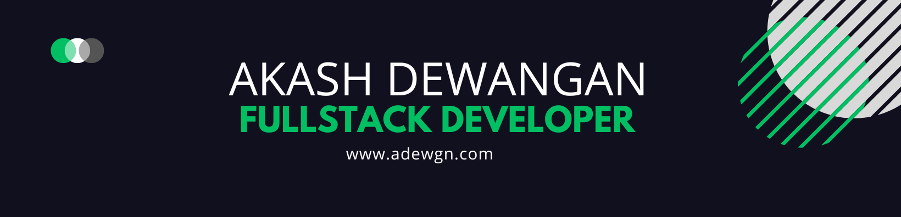

 
# 
 

<!--
  
-->

<!--
  
-->

<h2>👨‍💻 ABOUT ME</h2>

Results-driven Data Science student with a strong aptitude for problem solving and an admiration of technology. I have practical expertise in software development, data structures, and algorithms from coursework and personal projects, and I am proficient in multiple programming languages and frameworks.

 

      
      
   

 

<h4> CONNECT WITH ME :
 

<!---->

<!-- 

<h4>YOU CAN ALSO FIND ME ON:</h4>
 

-->

---

<h2>📡 TECH STACK</h2>

<h3>👨‍💻 Programming and Markup Languages</h3>

  

<h3>👨‍💻 Database and Cloud Hosting</h3>

  

<h3>🧰 Frameworks and Libraries</h3>
 

  

 <h3>💻 Software and Tools</h3>
 

  

---

<h2>📊 GITHUB STATS </h2>

  <h3 align="left">🔥 Streak Stats</h3>

  

    
  

  <h3>💻 GitHub Profile Stats</h3>

  <!-- https://github.com/anuraghazra/github-readme-stats -->

  
  
   

  <b>Note:</b> Top languages is only a metric of the languages my public code consists of and doesn't reflect experience or skill level.
  

  

---

<h2>📕 TOP REPOSITORIES</h2>

 

    
    
    
    
    
    
  

  

---

# 
 

