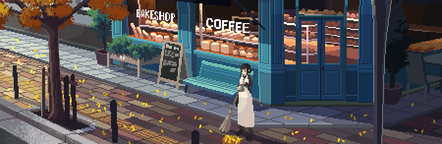

<link rel="preconnect" href="https://fonts.googleapis.com">
<link rel="preconnect" href="https://fonts.gstatic.com" crossorigin>
<link href="https://fonts.googleapis.com/css2?family=Jersey+10&display=swap" rel="stylesheet">
 

# 
 

<h2>👨‍💻 ABOUT ME</h2>

Data-driven problem solver with a passion for coding, competitive programming, and avoiding the dreaded 'out of memory' error. I'm a full-stack developer who's currently trying to convince my neural network that it's not actually sentient (yet). Beyond my technical skills, I'm a dedicated open-source contributor and a competitive programmer who's always on the lookout for a challenging problem. Let's connect and build something awesome together – or at least something that doesn't crash. 😉

 

      
      
   

 
 
  
<h4>CONNECT WITH ME ON:
 
 

 

  

 
---
 

<h2>📡 TECH STACK</h2>

<h3>👨‍💻 Programming and Markup Languages</h3>

  

 
<h3>👨‍💻 Database and Cloud Hosting</h3>

  

<h3>🧰 Frameworks and Libraries</h3>
 

  

 <h3>💻 Software and Tools</h3>
 

  

---

<h2>📊 GITHUB STATS </h2>

  <h3 align="left">🌊 Streak Stats</h3>

  

    
  

  <h3>💻 GitHub Profile Stats</h3>

  

    
    
  

   

  

  <b>Note:</b> Top languages is only a metric of the languages my public code consists of and doesn't reflect experience or skill level.
   
   
    
  

---
 
 

# 
 

